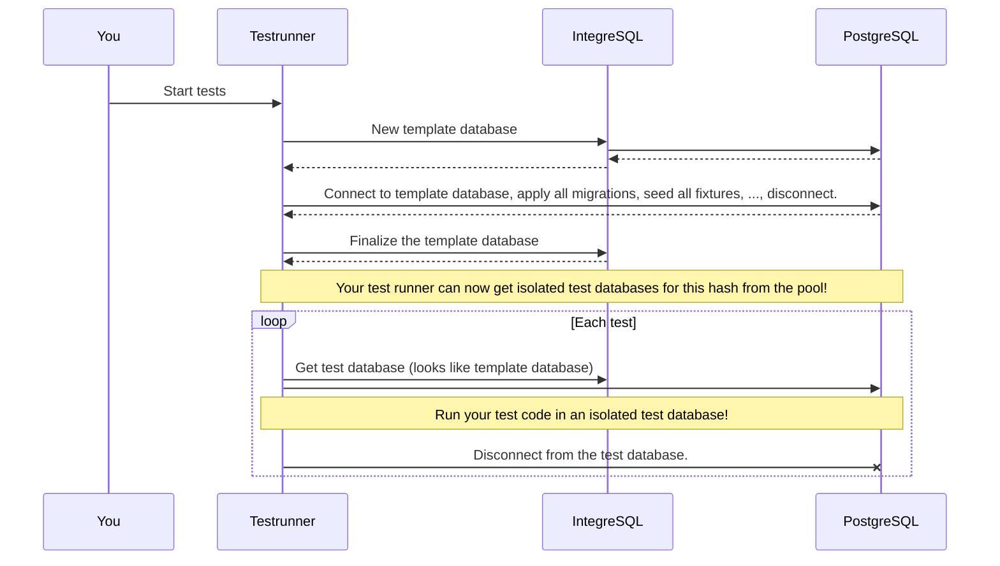
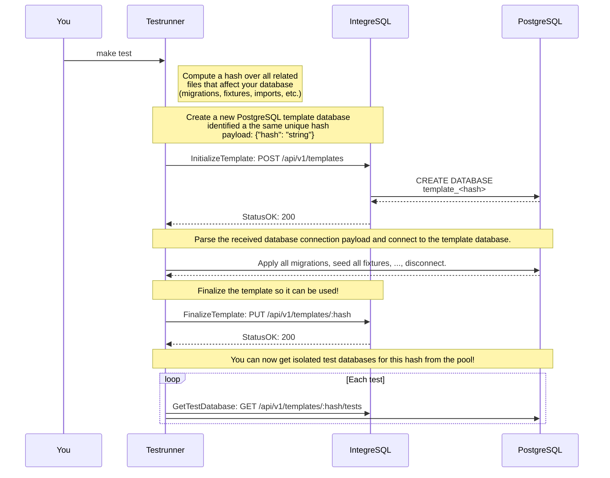
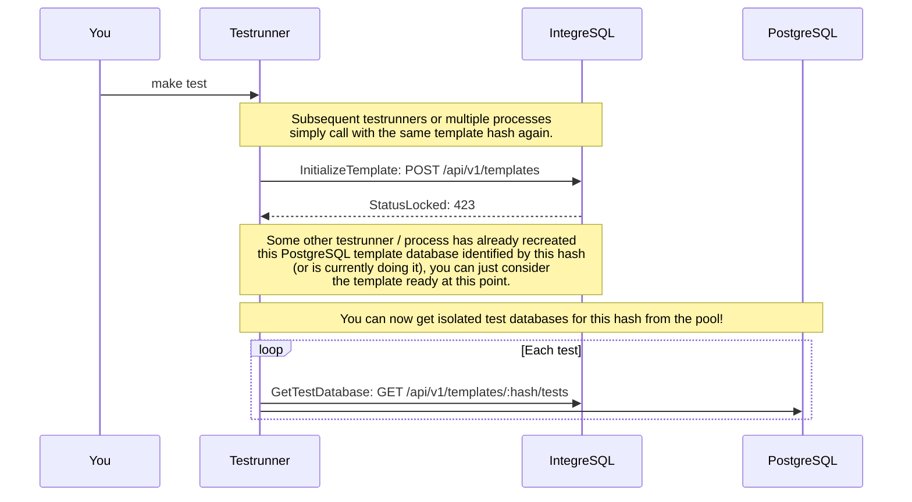
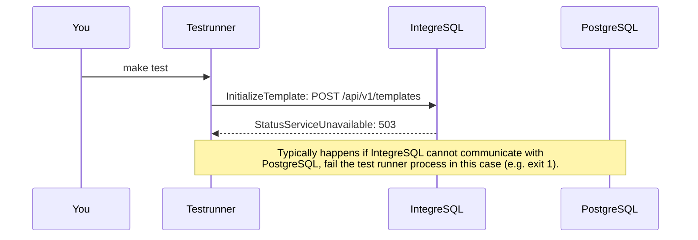
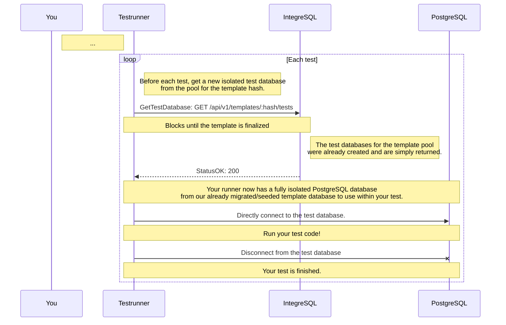
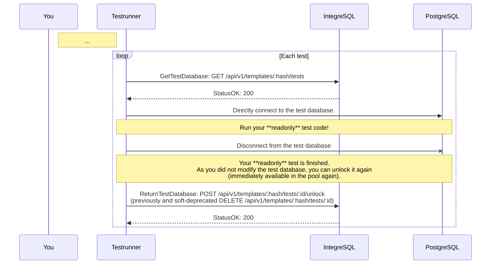
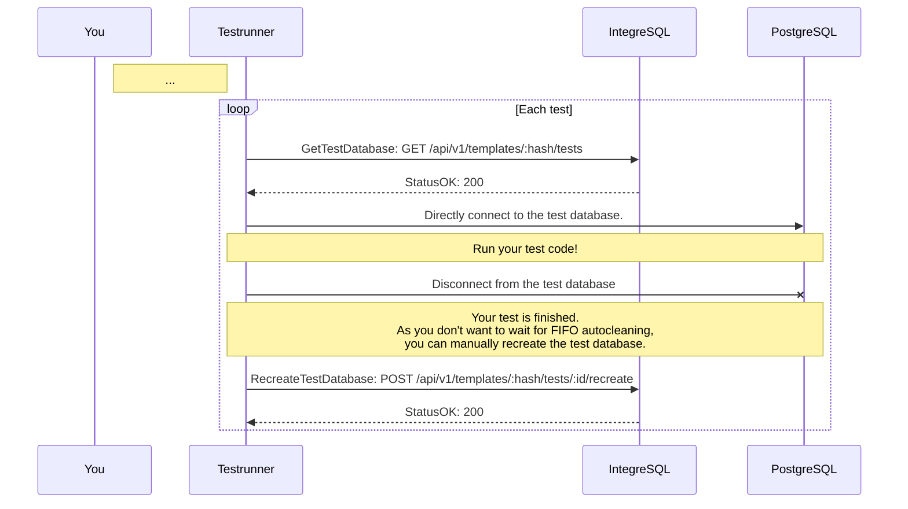
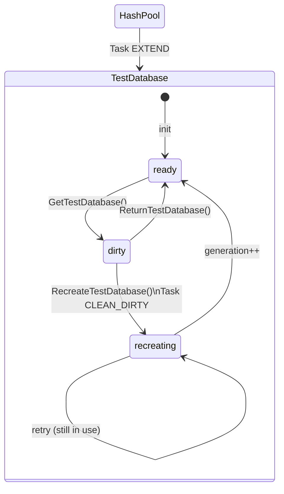
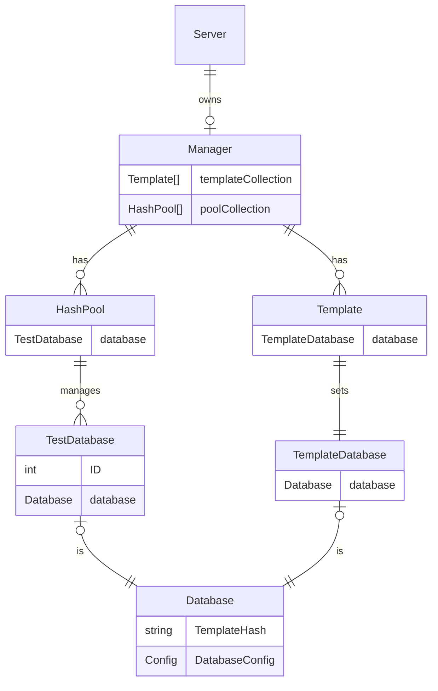
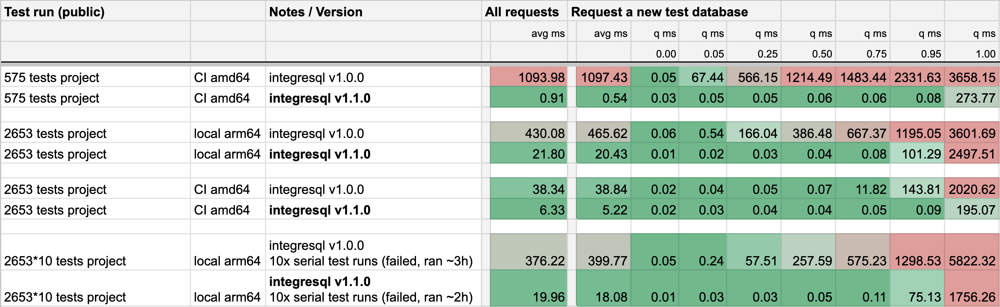

<!-- 
This file contains [mermaid](https://mermaid.js.org) diagrams.

In VSCode:
* install `bierner.markdown-mermaid` to have easy preview.
* install `bpruitt-goddard.mermaid-markdown-syntax-highlighting` for syntax highlighting.
-->

# IntegreSQL

IntegreSQL manages isolated PostgreSQL databases for your integration tests.

Do your engineers a favour by allowing them to write fast executing, parallel and deterministic integration tests utilizing **real** PostgreSQL test databases. Resemble your live environment in tests as close as possible.   



[](https://goreportcard.com/report/github.com/allaboutapps/integresql) 

- [IntegreSQL](#integresql)
  - [Install](#install)
  - [Usage](#usage)
    - [Run using Docker (preferred)](#run-using-docker-preferred)
    - [Run locally (not recommended)](#run-locally-not-recommended)
    - [Run within your CI/CD](#run-within-your-cicd)
      - [GitHub Actions](#github-actions)
  - [Integrate](#integrate)
    - [Integrate by client lib](#integrate-by-client-lib)
    - [Integrate by RESTful JSON calls](#integrate-by-restful-json-calls)
      - [Once per test runner/process](#once-per-test-runnerprocess)
        - [Testrunner creates a new template database](#testrunner-creates-a-new-template-database)
        - [Testrunner reuses an existing template database](#testrunner-reuses-an-existing-template-database)
        - [Failure modes while template database setup: 503](#failure-modes-while-template-database-setup-503)
      - [Per each test](#per-each-test)
        - [New test database per test](#new-test-database-per-test)
        - [Optional: Manually unlocking a test database after a readonly test](#optional-manually-unlocking-a-test-database-after-a-readonly-test)
        - [Optional: Manually recreating a test database](#optional-manually-recreating-a-test-database)
        - [Failure modes while getting a new test database](#failure-modes-while-getting-a-new-test-database)
          - [StatusNotFound 404](#statusnotfound-404)
          - [StatusGone 410](#statusgone-410)
          - [StatusServiceUnavailable 503](#statusserviceunavailable-503)
      - [Demo](#demo)
  - [Configuration](#configuration)
  - [Architecture](#architecture)
    - [TestDatabase states](#testdatabase-states)
    - [Pool structure](#pool-structure)
  - [Background](#background)
    - [Approach 0: Leaking database mutations for subsequent tests](#approach-0-leaking-database-mutations-for-subsequent-tests)
    - [Approach 1: Isolating by resetting](#approach-1-isolating-by-resetting)
    - [Approach 2a: Isolation by transactions](#approach-2a-isolation-by-transactions)
    - [Approach 2b: Isolation by mocking](#approach-2b-isolation-by-mocking)
    - [Approach 3a: Isolation by templates](#approach-3a-isolation-by-templates)
    - [Approach 3b: Isolation by cached templates](#approach-3b-isolation-by-cached-templates)
    - [Approach 3c: Isolation by cached templates and pool](#approach-3c-isolation-by-cached-templates-and-pool)
      - [Approach 3c benchmark 1: Baseline](#approach-3c-benchmark-1-baseline)
      - [Approach 3c benchmark 2: Small project](#approach-3c-benchmark-2-small-project)
    - [Final approach: IntegreSQL](#final-approach-integresql)
  - [Benchmarks](#benchmarks)
    - [Benchmark v1.1.0 vs v1.0.0](#benchmark-v110-vs-v100)
  - [Contributing](#contributing)
    - [Development setup](#development-setup)
    - [Development quickstart](#development-quickstart)
  - [Maintainers](#maintainers)
    - [Previous maintainers](#previous-maintainers)
  - [License](#license)


## Install

A minimal Docker image containing is published on GitHub Packages. See [GitHub Releases](https://github.com/allaboutapps/integresql/releases).

```bash
docker pull ghcr.io/allaboutapps/integresql:<TAG>
```

## Usage

### Run using Docker (preferred)

Simply start a [Docker](https://docs.docker.com/install/) (19.03 or above) container, provide the required environment variables and expose the server port:

```bash
docker run -d --name integresql -e INTEGRESQL_PORT=5000 -p 5000:5000 ghcr.io/allaboutapps/integresql:<TAG>
```

The container can also be included in your project via [Docker Compose](https://docs.docker.com/compose/install/) (1.25 or above):

```yaml
version: "3.4"
services:

  # Your main service image
  service:
    depends_on:
      - postgres
      - integresql
    environment:
      PGDATABASE: &PGDATABASE "development"
      PGUSER: &PGUSER "dbuser"
      PGPASSWORD: &PGPASSWORD "9bed16f749d74a3c8bfbced18a7647f5"
      PGHOST: &PGHOST "postgres"
      PGPORT: &PGPORT "5432"
      PGSSLMODE: &PGSSLMODE "disable"

      # optional: env for integresql client testing
      # see https://github.com/allaboutapps/integresql-client-go
      # INTEGRESQL_CLIENT_BASE_URL: "http://integresql:5000/api"

      # [...] additional main service setup

  integresql:
    image: ghcr.io/allaboutapps/integresql:<TAG>
    ports:
      - "5000:5000"
    depends_on:
      - postgres
    environment: 
      PGHOST: *PGHOST
      PGUSER: *PGUSER
      PGPASSWORD: *PGPASSWORD

  postgres:
    image: postgres:12.2-alpine # should be the same version as used live
    # ATTENTION
    # fsync=off, synchronous_commit=off and full_page_writes=off
    # gives us a major speed up during local development and testing (~30%),
    # however you should NEVER use these settings in PRODUCTION unless
    # you want to have CORRUPTED data.
    # DO NOT COPY/PASTE THIS BLINDLY.
    # YOU HAVE BEEN WARNED.
    # Apply some performance improvements to pg as these guarantees are not needed while running locally
    command: "postgres -c 'shared_buffers=128MB' -c 'fsync=off' -c 'synchronous_commit=off' -c 'full_page_writes=off' -c 'max_connections=100' -c 'client_min_messages=warning'"
    expose:
      - "5432"
    ports:
      - "5432:5432"
    environment:
      POSTGRES_DB: *PGDATABASE
      POSTGRES_USER: *PGUSER
      POSTGRES_PASSWORD: *PGPASSWORD
    volumes:
      - pgvolume:/var/lib/postgresql/data

volumes:
  pgvolume: # declare a named volume to persist DB data
```

You may also refer to our [go-starter `docker-compose.yml`](https://github.com/allaboutapps/go-starter/blob/master/docker-compose.yml).

### Run locally (not recommended)

Installing IntegreSQL locally requires a working [Go](https://golang.org/dl/) (1.14 or above) environment. Install the `integresql` executable to your Go bin folder:

```bash
# This installs the latest version of IntegreSQL into your $GOBIN
go install github.com/allaboutapps/integresql/cmd/server@latest

# you may want to rename the binary to integresql after installing:
mv $GOBIN/server $GOBIN/integresql
```

Running the IntegreSQL server locally requires configuration via exported environment variables (see below).

```bash
export INTEGRESQL_PORT=5000
export PGHOST=127.0.0.1
export PGUSER=test
export PGPASSWORD=testpass
integresql
```

### Run within your CI/CD

You'll also want to use integresql within your CI/CD pipeline. We recommend using the Docker image. Simply run it next to the postgres service.

#### GitHub Actions

For a working sample see [allaboutapps/go-starter](https://github.com/allaboutapps/go-starter/blob/master/.github/workflows/build-test.yml). 

```yaml
jobs:
  build-test:
    runs-on: ubuntu-latest
    services:
      postgres:
        image: postgres:<TAG>
        env:
          POSTGRES_DB: "development"
          POSTGRES_USER: "dbuser"
          POSTGRES_PASSWORD: "dbpass"
        options: >-
          --health-cmd pg_isready
          --health-interval 10s
          --health-timeout 5s
          --health-retries 5
        ports:
          - 5432:5432
      integresql:
        image: ghcr.io/allaboutapps/integresql:<TAG>
        env:
          PGHOST: "postgres"
          PGUSER: "dbuser"
          PGPASSWORD: "dbpass"
```


## Integrate

IntegreSQL is a RESTful JSON API distributed as Docker image and go cli. It's language agnostic and manages multiple [PostgreSQL templates](https://supabase.io/blog/2020/07/09/postgresql-templates/) and their separate pool of test databases for your tests. It keeps the pool of test databases warm (as it's running in the background) and is fit for parallel test execution with multiple test runners / processes.

You will typically want to integrate by a client lib (see below), but you can also integrate by RESTful JSON calls directly. The flow is illustrated in the follow up section. 

### Integrate by client lib

It's simple to integrate especially if there is already an client library available for your specific language. We currently have those:

* Go: [integresql-client-go](https://github.com/allaboutapps/integresql-client-go) by [Nick Müller - @MorpheusXAUT](https://github.com/MorpheusXAUT)
* Python: [integresql-client-python](https://github.com/msztolcman/integresql-client-python) by [Marcin Sztolcman - @msztolcman](https://github.com/msztolcman)
* .NET: [IntegreSQL.EF](https://github.com/mcctomsk/IntegreSql.EF) by [Artur Drobinskiy - @Shaddix](https://github.com/Shaddix)
* JavaScript/TypeScript: [@devoxa/integresql-client](https://github.com/devoxa/integresql-client) by [Devoxa - @devoxa](https://github.com/devoxa)
* ... *Add your link here and make a PR*

### Integrate by RESTful JSON calls

A really good starting point to write your own integresql-client for a specific language can be found [here (go code)](https://github.com/allaboutapps/integresql-client-go/blob/master/client.go) and [here (godoc)](https://pkg.go.dev/github.com/allaboutapps/integresql-client-go?tab=doc). It's just RESTful JSON after all.

First start IntegreSQL and leave it running in the background (your PostgreSQL template and test database pool will then always be warm). When you trigger your test command (e.g. `make test`), 1..n test runners/processes can start in parallel and get ready and isoloated test database from the pool (after the template database(s) was/were initialized).

#### Once per test runner/process

Each test runner starts and need to communicate with IntegreSQL to setup 1..n template database pools. The following sections describe the flows/scenarios you need to implement.

##### Testrunner creates a new template database



##### Testrunner reuses an existing template database



##### Failure modes while template database setup: 503



#### Per each test

##### New test database per test

Well, this is the normal flow to get a new isolated test database (prepopulated as its created from the template) for your test.



##### Optional: Manually unlocking a test database after a readonly test

* Returns the given test DB directly to the pool, without cleaning (recreating it).
* **This is optional!** If you don't call this endpoints, the test database will be recreated in a FIFO manner (first in, first out) as soon as possible, even though it actually had no changes.
* This is useful if you are sure, you did not do any changes to the database and thus want to skip the recreation process by returning it to the pool directly.




##### Optional: Manually recreating a test database

* Recreates the test DB according to the template and returns it back to the pool.
* **This is optional!** If you don't call this endpoint, the test database will be recreated in a FIFO manner (first in, first out) as soon as possible.
* This is useful if you have parallel testing with a mix of very long and super short tests. Our auto–FIFO recreation handling might block there.




##### Failure modes while getting a new test database

Some typical status codes you might encounter while getting a new test database.

###### StatusNotFound 404

Well, seems like someone forgot to call InitializeTemplate or it errored out.

###### StatusGone 410

There was an error during test setup with our fixtures, someone called `DiscardTemplate`, thus this template cannot be used.

###### StatusServiceUnavailable 503

Well, typically a PostgreSQL connectivity problem

#### Demo

If you want to take a look on how we integrate IntegreSQL - 🤭 - please just try our [go-starter](https://github.com/allaboutapps/go-starter) project or take a look at our [test_database setup code](https://github.com/allaboutapps/go-starter/blob/master/internal/test/test_database.go). 

## Configuration

IntegreSQL requires little configuration, all of which has to be provided via environment variables (due to the intended usage in a Docker environment). The following settings are available:

| Description                                                                                          | Environment variable                                | Required | Default                                                   |
| ---------------------------------------------------------------------------------------------------- | --------------------------------------------------- | -------- | --------------------------------------------------------- |
| Server listen address (defaults to all if empty)                                                     | `INTEGRESQL_ADDRESS`                                |          | `""`                                                      |
| Server port                                                                                          | `INTEGRESQL_PORT`                                   |          | `5000`                                                    |
| PostgreSQL: host                                                                                     | `INTEGRESQL_PGHOST`, `PGHOST`                       | Yes      | `"127.0.0.1"`                                             |
| PostgreSQL: port                                                                                     | `INTEGRESQL_PGPORT`, `PGPORT`                       |          | `5432`                                                    |
| PostgreSQL: username                                                                                 | `INTEGRESQL_PGUSER`, `PGUSER`, `USER`               | Yes      | `"postgres"`                                              |
| PostgreSQL: password                                                                                 | `INTEGRESQL_PGPASSWORD`, `PGPASSWORD`               | Yes      | `""`                                                      |
| PostgreSQL: database for manager                                                                     | `INTEGRESQL_PGDATABASE`                             |          | `"postgres"`                                              |
| PostgreSQL: template database to use                                                                 | `INTEGRESQL_ROOT_TEMPLATE`                          |          | `"template0"`                                             |
| Managed databases: prefix                                                                            | `INTEGRESQL_DB_PREFIX`                              |          | `"integresql"`                                            |
| Managed *template* databases: prefix `integresql_template_<HASH>`                                    | `INTEGRESQL_TEMPLATE_DB_PREFIX`                     |          | `"template"`                                              |
| Managed *test* databases: prefix `integresql_test_<HASH>_<ID>`                                       | `INTEGRESQL_TEST_DB_PREFIX`                         |          | `"test"`                                                  |
| Managed *test* databases: username                                                                   | `INTEGRESQL_TEST_PGUSER`                            |          | PostgreSQL: username                                      |
| Managed *test* databases: password                                                                   | `INTEGRESQL_TEST_PGPASSWORD`                        |          | PostgreSQL: password                                      |
| Managed *test* databases: minimal test pool size                                                     | `INTEGRESQL_TEST_INITIAL_POOL_SIZE`                 |          | [`runtime.NumCPU()`](https://pkg.go.dev/runtime#NumCPU)   |
| Managed *test* databases: maximal test pool size                                                     | `INTEGRESQL_TEST_MAX_POOL_SIZE`                     |          | [`runtime.NumCPU()*4`](https://pkg.go.dev/runtime#NumCPU) |
| Maximal number of pool tasks running in parallel                                                     | `INTEGRESQL_POOL_MAX_PARALLEL_TASKS`                |          | [`runtime.NumCPU()`](https://pkg.go.dev/runtime#NumCPU)   |
| Minimal time to wait after a test db recreate has failed                                             | `INTEGRESQL_TEST_DB_RETRY_RECREATE_SLEEP_MIN_MS`    |          | `250`ms                                                   |
| The maximum possible sleep time between recreation retries                                           | `INTEGRESQL_TEST_DB_RETRY_RECREATE_SLEEP_MAX_MS`    |          | `3000`ms                                                  |
| Get test-database blocks auto-recreation (FIFO) for this duration                                    | `INTEGRESQL_TEST_DB_MINIMAL_LIFETIME_MS`            |          | `250`ms                                                   |
| Internal time to wait for a template-database to transition into the 'finalized' state               | `INTEGRESQL_TEMPLATE_FINALIZE_TIMEOUT_MS`           |          | `60000`ms                                                 |
| Internal time to wait for a ready database                                                           | `INTEGRESQL_TEST_DB_GET_TIMEOUT_MS`                 |          | `60000`ms                                                 |
| Enables [pprof debug endpoints](https://golang.org/pkg/net/http/pprof/) under `/debug/*`             | `INTEGRESQL_DEBUG_ENDPOINTS`                        |          | `false`                                                   |
| Enables [echo framework debug mode](https://echo.labstack.com/docs/customization)                    | `INTEGRESQL_ECHO_DEBUG`                             |          | `false`                                                   |
| [Enables CORS](https://echo.labstack.com/docs/middleware/cors)                                       | `INTEGRESQL_ECHO_ENABLE_CORS_MIDDLEWARE`            |          | `true`                                                    |
| [Enables logger](https://echo.labstack.com/docs/middleware/logger)                                   | `INTEGRESQL_ECHO_ENABLE_LOGGER_MIDDLEWARE`          |          | `true`                                                    |
| [Enables recover](https://echo.labstack.com/docs/middleware/recover)                                 | `INTEGRESQL_ECHO_ENABLE_RECOVER_MIDDLEWARE`         |          | `true`                                                    |
| [Sets request_id to context](https://echo.labstack.com/docs/middleware/request-id)                   | `INTEGRESQL_ECHO_ENABLE_REQUEST_ID_MIDDLEWARE`      |          | `true`                                                    |
| [Auto-adds trailing slash](https://echo.labstack.com/docs/middleware/trailing-slash)                 | `INTEGRESQL_ECHO_ENABLE_TRAILING_SLASH_MIDDLEWARE`  |          | `true`                                                    |
| [Enables timeout middleware](https://echo.labstack.com/docs/middleware/timeout)                      | `INTEGRESQL_ECHO_ENABLE_REQUEST_TIMEOUT_MIDDLEWARE` |          | `true`                                                    |
| Generic timeout handling for most endpoints                                                          | `INTEGRESQL_ECHO_REQUEST_TIMEOUT_MS`                |          | `60000`ms                                                 |
| Show logs of [severity](https://github.com/rs/zerolog?tab=readme-ov-file#leveled-logging)            | `INTEGRESQL_LOGGER_LEVEL`                           |          | `"info"`                                                  |
| Request log [severity]([severity](https://github.com/rs/zerolog?tab=readme-ov-file#leveled-logging)) | `INTEGRESQL_LOGGER_REQUEST_LEVEL`                   |          | `"info"`                                                  |
| Should the request-log include the body?                                                             | `INTEGRESQL_LOGGER_LOG_REQUEST_BODY`                |          | `false`                                                   |
| Should the request-log include headers?                                                              | `INTEGRESQL_LOGGER_LOG_REQUEST_HEADER`              |          | `false`                                                   |
| Should the request-log include the query?                                                            | `INTEGRESQL_LOGGER_LOG_REQUEST_QUERY`               |          | `false`                                                   |
| Should the request-log include the response body?                                                    | `INTEGRESQL_LOGGER_LOG_RESPONSE_BODY`               |          | `false`                                                   |
| Should the request-log include the response header?                                                  | `INTEGRESQL_LOGGER_LOG_RESPONSE_HEADER`             |          | `false`                                                   |
| Should the console logger pretty-print the log (instead of json)?                                    | `INTEGRESQL_LOGGER_PRETTY_PRINT_CONSOLE`            |          | `false`                                                   |


##  Architecture

### TestDatabase states

The following describes the state and transitions of a TestDatabase.



### Pool structure

The following describes the relationship between the components of IntegreSQL.




## Background

We came a long way to realize that something just did not feel right with our PostgreSQL integration testing strategies.
This is a loose summary of how this project came to life.

### Approach 0: Leaking database mutations for subsequent tests

Testing our customer backends actually started quite simple:

* Test runner starts
* Recreate a PostgreSQL test database
* Apply all migrations
* Seed all fixtures
* Utilizing the same PostgreSQL test database for each test:
  * **Run your test code** 
* Test runner ends

It's quite easy to spot the problem with this approach. Data may be mutated by any single test and is visible from all subsequent tests. It becomes cumbersome to make changes in your test code if you can't rely on a clean state in each and every test.

### Approach 1: Isolating by resetting

Let's try to fix that like this:

* Test runner starts
* Recreate a PostgreSQL test database
* **Before each** test: 
  * Truncate
  * Apply all migrations
  * Seed all fixtures
* Utilizing the same PostgreSQL test database for each test:
  * **Run your test code** 
* Test runner ends

Well, it's now isolated - but testing time has increased by a rather high factor and is totally dependent on your truncate/migrate/seed operations.

### Approach 2a: Isolation by transactions

What about using database transactions?

* Test runner starts
* Recreate a PostgreSQL test database
* Apply all migrations
* Seed all fixtures
* **Before each** test: 
  * Start a new database transaction
* Utilizing the same PostgreSQL test database for each test:
  * **Run your test code** 
* **After each** test:
  * Rollback the database transaction
* Test runner ends

After spending various time to rewrite all code to actually use the injected database transaction in each code, you realize that nested transactions are not supported and can only be poorly emulated using save points. All database transaction specific business code, especially their potential error state, is not properly testable this way. You therefore ditch this approach.

### Approach 2b: Isolation by mocking

What about using database mocks?

* Test runner starts
* Utilizing an in-memory mock database isolated for each test:
  * **Run your test code** 
* Test runner ends

I'm generally not a fan of emulating database behavior through a mocking layer while testing/implementing. Even minor version changes of PostgreSQL plus it's extensions (e.g. PostGIS) may introduce slight differences, e.g. how indices are used, function deprecations, query planner, etc. . It might not even be an erroneous result, just performance regressions or slight sorting differences in the returned query result.

We try to approximate local/test and live as close as possible, therefore using the same database, with the same extensions in their exact same version is a hard requirement for us while implementing/testing locally.

### Approach 3a: Isolation by templates

We discovered that using [PostgreSQL templates](https://supabase.com/blog/2020/07/09/postgresql-templates) and creating the actual new test database from them is quite fast, let's to this:

* Test runner starts
* Recreate a PostgreSQL template database
* Apply all migrations
* Seed all fixtures
* **Before each** test: 
  * Create a new PostgreSQL test database from our already migrated/seeded template database
* Utilizing a new isolated PostgreSQL test database for each test:
  * **Run your test code** 
* Test runner ends

Well, we are up in speed again, but we still can do better, how about...

### Approach 3b: Isolation by cached templates

* Test runner starts
* Check migrations/fixtures have changed (hash over all related files)
  * Yes
    * Recreate a PostgreSQL template database
    * Apply all migrations
    * Seed all fixtures
  * No, nothing has changed
    * Simply reuse the previous PostgreSQL template database
* **Before each** test: 
  * Create a new PostgreSQL test database from our already migrated/seeded template database
* Utilizing a new isolated PostgreSQL test database for each test:
  * **Run your test code** 
* Test runner ends

This gives a significant speed bump as we no longer need to recreate our template database if no files related to the database structure or fixtures have changed. However, we still need to create a new PostgreSQL test database from a template before running any test. Even though this is quite fast, could we do better?

### Approach 3c: Isolation by cached templates and pool

* Test runner starts
* Check migrations/fixtures have changed (hash over all related files)
  * Yes
    * Recreate a PostgreSQL template database
    * Apply all migrations
    * Seed all fixtures
  * No, nothing has changed
    * Simply reuse the previous PostgreSQL template database
* Create a pool of n PostgreSQL test databases from our already migrated/seeded template database
* **Before each** test: 
  * Select the first new PostgreSQL test database that is ready from the test pool
* Utilizing your selected PostgreSQL test database from the test pool for each test:
  * **Run your test code** 
* **After each** test: 
  * If there are still tests lefts to run add some additional PostgreSQL test databases from our already migrated/seeded template database
* Test runner ends

Finally, by keeping a warm pool of test database we arrive at the speed of Approach 0, while having the isolation gurantees of all subsequent approaches.
This is actually the (simplified) strategy, that we have used in [allaboutapps-backend-stack](https://github.com/allaboutapps/aaa-backend-stack) for many years.

#### Approach 3c benchmark 1: Baseline

Here's a quick benchmark of how this strategy typically performed back then:

```bash
--- ----------------<storageHelper strategy report>---------------- ---
    replicas switched:          50     avg=11ms min=1ms max=445ms
    replicas awaited:           1      prebuffer=8 avg=436ms max=436ms
    background replicas:        58     avg=272ms min=41ms max=474ms
    - warm up template (cold):  82%    2675ms
        * truncate:             62%    2032ms
        * migrate:              18%    594ms
        * seed:                 1%     45ms
    - switching:                17%    571ms
        * disconnect:           1%     42ms
        * switch replica:       14%    470ms
            - resolve next:     1%     34ms
            - await next:       13%    436ms
        * reinitialize:         1%     57ms
    strategy related time:      ---    3246ms
    vs total executed time:     20%    15538ms
--- ---------------</ storageHelper strategy report>--------------- ---
```

This is a rather small testsuite with `50` tests and with a tiny database. Thus the whole test run was finished in `~15sec`. `~2.7sec` were spend setting up the template within the warm up (truncate + migrate + seed) and `~0.6sec` in total waiting for a new test/replica databases to become available for a test. We spend `~20%` of our total execution time running / waiting inside our test strategy approach. 

This a cold start. You pay for this warm-up flow only if no template database was cached by a previous test run (if your migrations + fixtures files - the `hash` over these files - hasn't changed).

A new test database (called a replica here) from this tiny template database took max. `~500ms` to create, on avg. this was ~halfed and most importantly can be done in the background (while some tests already execute).

The cool thing about having a warm pool of replicas setup in the background, is that selecting new replicas from the pool is blazingly fast, as typically they *will be already ready* when it's time to execute the next test. For instance, it took `~500ms` max. and **`11ms` on avg.** to select a new replica for all subsequent tests (we only had to wait once until a replica became available for usage within a test - typically it's the first test to be executed).

#### Approach 3c benchmark 2: Small project

Let's look at a sightly bigger testsuite and see how this approach may possibly scale:

```bash
--- -----------------<storageHelper strategy report>------------------ ---
    replicas switched:             280    avg=26ms min=11ms max=447ms
    replicas awaited:              1      prebuffer=8 avg=417ms max=417ms
    background replicas:           288    avg=423ms min=105ms max=2574ms
    - warm up template (cold):     40%    5151ms
        * truncate:                8%     980ms
        * migrate:                 26%    3360ms
        * seed:                    4%     809ms
    - switching:                   60%    7461ms
        * disconnect:              2%     322ms
        * switch replica:          6%     775ms
            - resolve next:        2%     358ms
            - await next:          3%     417ms
        * reinitialize:            50%    6364ms
    strategy related time:         ---    12612ms
    vs total executed time:        11%    111094ms
--- ----------------</ storageHelper strategy report>----------------- ---
```

This test suite is larger and comes with `280` tests, the whole test run finished in `~1m50s` (`~390ms` per test on avg.). `~5.2sec` were spend setting up the template and `~7.5sec` in total waiting for a new test / replica databases to become available for a test.

The rise in switching time is expected, as we need way more replicas / test databases this time, however we only spend `~11%` running / waiting inside our test strategy approach. To put that into perspective, each test only had to **wait `~26ms` on avg.** until it could finally execute (and typically, this is solely the time it needs to open up a new database connection).

This should hopefully give you some base understanding on why we consider this testing approach essential for our projects. It's the sweet combination of speed and isolation. 

### Final approach: IntegreSQL

We realized that having the above pool logic directly within the test runner is actually counterproductive and is further limiting usage from properly utilizing parallel testing (+performance).

As we switched to Go as our primary backend engineering language, we needed to rewrite the above logic anyways and decided to provide a safe and language agnostic way to utilize this testing strategy with PostgreSQL.

This is how IntegreSQL was born.

## Benchmarks

### Benchmark v1.1.0 vs v1.0.0

We focued on improving the pool manager performance in v1.1.0, especially when it comes to locking and thus request latency.



The main goal was to bring IntegreSQL's performance on par with our previous native Node.js implementation, which we also benchmarked:

```bash

# Previous Node.js implementation 
--- -----------------<storageHelper strategy report>------------------ ---
    replicas switched:             563    avg=14ms min=6ms max=316ms
    replicas awaited:              1      prebuffer=8 avg=301ms max=301ms
    background replicas:           571    avg=-ms min=-ms max=1180ms
    - warm up:                     32%    4041ms 
        * drop/cache check:        4%     561ms 
        * migrate/cache reuse:     25%    3177ms 
        * fixtures:                2%     302ms
        * special:                 0%     0ms
        * create pool:             0%     1ms
    - switching:                   67%    8294ms
        * disconnect:              1%     139ms
        * switch slave:            4%     591ms
            - resolve next:        2%     290ms
            - await next:          2%     301ms
        * reinitialize:            61%    7563ms
    strategy related time:                12335ms 
    vs total executed time:        11%    106184ms
--- ----------------</ storageHelper strategy report>----------------- ---
Done in 106.60s.

# IntegreSQL v1.1.0 (next version)
--- -----------------<integresql strategy report>------------------ ---
    replicas switched:             563    avg=70ms min=58ms max=603ms
    replicas awaited:              1      prebuffer=8 avg=72ms max=72ms
    background replicas:           571    avg=58ms min=49ms max=520ms
    - warm up:                     9%     4101ms
        * drop/cache check:        0%     1ms
        * migrate/cache reuse:     8%     3520ms
        * fixtures:                0%     296ms
        * special:                 0%     0ms
        * create pool:             0%     284ms
    - switching:                   90%    39865ms
        * disconnect:              0%     120ms
        * switch replica:          0%     261ms (563x min=0ms q25=0ms q50=0ms q75=1ms q95=1ms max=72ms)
            - resolve next:        0%     189ms
            - await next:          0%     72ms
        * reinitialize:            89%    39478ms (563x min=58ms q25=66ms q50=68ms q75=71ms q95=80ms max=531ms)
    strategy related time:                43966ms
    vs total executed time:        40%    109052ms
--- ----------------</ integresql strategy report>----------------- ---
Done in 109.45s.

# IntegreSQL v1.0.0 (previous version)
--- -----------------<integresql strategy report>------------------ ---
    replicas switched:             563    avg=131ms min=9ms max=2019ms
    replicas awaited:              94     prebuffer=8 avg=590ms max=1997ms
    background replicas:           571    avg=1292ms min=52ms max=3817ms
    - warm up:                     7%     6144ms
        * drop/cache check:        0%     0ms
        * migrate/cache reuse:     4%     3587ms
        * fixtures:                0%     298ms
        * special:                 0%     0ms
        * create pool:             2%     2259ms
    - switching:                   92%    73837ms
        * disconnect:              0%     112ms
        * switch replica:          64%    51552ms (563x min=0ms q25=0ms q50=0ms q75=1ms q95=773ms max=1997ms)
            - resolve next:        5%    3922ms
            - await next:          69%    55474ms
        * reinitialize:            27%    22169ms (563x min=9ms q25=12ms q50=15ms q75=19ms q95=187ms max=1201ms)
    strategy related time:                79981ms
    vs total executed time:        51%    153889ms
--- ----------------</ integresql strategy report>----------------- ---
Done in 154.29s.
```


## Contributing

Pull requests are welcome. For major changes, please [open an issue](https://github.com/allaboutapps/integresql/issues/new) first to discuss what you would like to change.

Please make sure to update tests as appropriate.

### Development setup

IntegreSQL requires the following local setup for development:

- [Docker CE](https://docs.docker.com/install/) (19.03 or above)
- [Docker Compose](https://docs.docker.com/compose/install/) (1.25 or above)

The project makes use of the [devcontainer functionality](https://code.visualstudio.com/docs/remote/containers) provided by [Visual Studio Code](https://code.visualstudio.com/) so no local installation of a Go compiler is required when using VSCode as an IDE.

Should you prefer to develop IntegreSQL without the Docker setup, please ensure a working [Go](https://golang.org/dl/) (1.14 or above) environment has been configured as well as a PostgreSQL instance is available (tested against version 12 or above, but *should* be compatible to lower versions) and the appropriate environment variables have been configured as described in the [Install](#install) section.

### Development quickstart

1. Start the local docker-compose setup and open an interactive shell in the development container:

```bash
# Build the development Docker container, start it and open a shell
./docker-helper.sh --up
```

2. Initialize the project, downloading all dependencies and tools required (executed within the dev container):

```bash
# Init dependencies/tools
make init

# Build executable (generate, format, build, vet)
make
```

3. Execute project tests and start server:

```bash
# Execute tests
make test

# Run IntegreSQL server with config from environment
integresql
```

## Maintainers

- [Mario Ranftl - @majodev](https://github.com/majodev)

### Previous maintainers

- [Anna - @anjankow](https://github.com/anjankow)
- [Nick Müller - @MorpheusXAUT](https://github.com/MorpheusXAUT)

## License

[MIT](LICENSE) © 2020-2024 aaa – all about apps GmbH | Nick Müller | Mario Ranftl and the IntegreSQL project contributors
