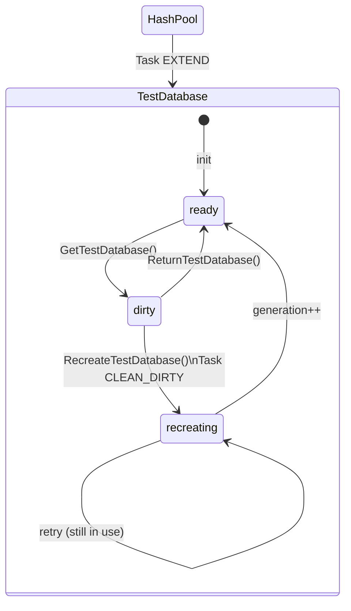
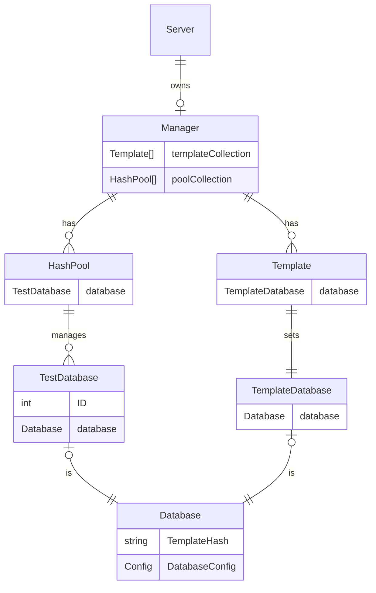

<!-- 
This file contains [mermaid](https://mermaid.js.org) diagrams.

In VSCode:
* install `bierner.markdown-mermaid` to have easy preview.
* install `bpruitt-goddard.mermaid-markdown-syntax-highlighting` for syntax highlighting.

To Export:
* npm install -g @mermaid-js/mermaid-cli
* mmdc -i arch.template.md -o arch.md

Syntax, see https://mermaid.js.org/syntax/entityRelationshipDiagram.html
-->

# IntegreSQL Architecture

## TestDatabase states

The following describes the state and transitions of a TestDatabase.

## Pool structure

The following describes the relationship between the components of IntegreSQL.

