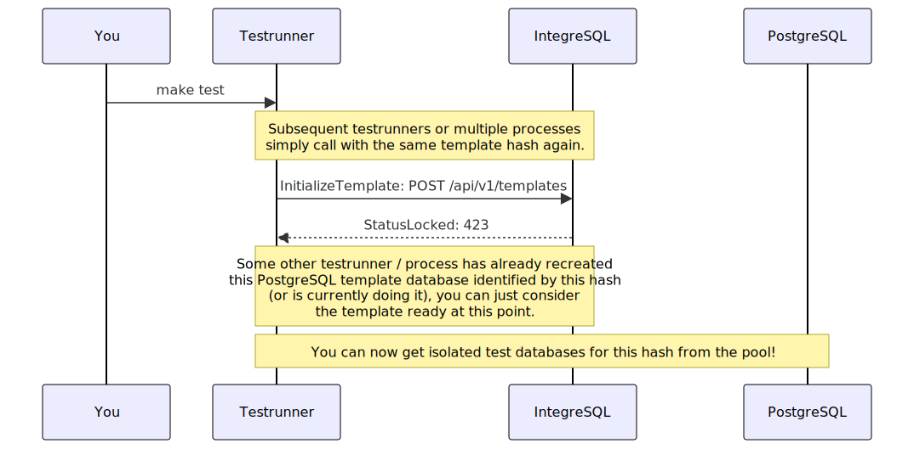
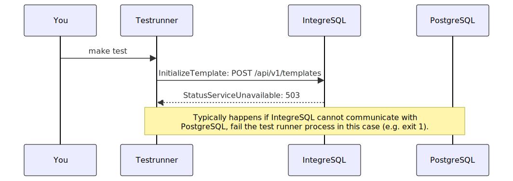
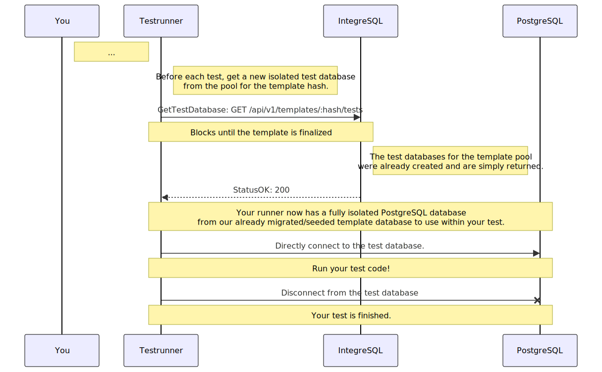
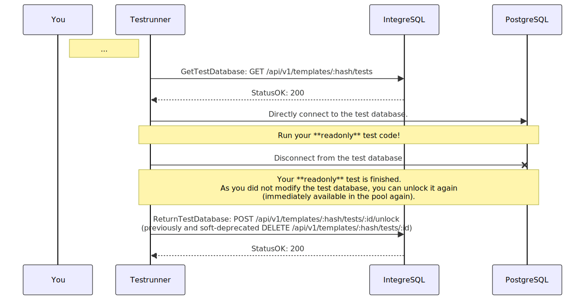
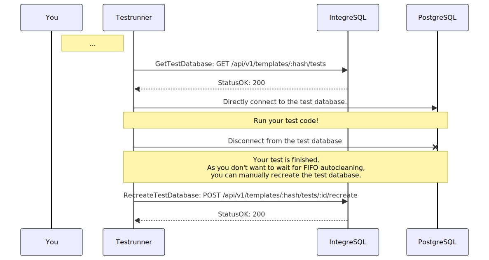

<!-- 
This file contains [mermaid](https://mermaid.js.org) diagrams.

In VSCode:
* install `bierner.markdown-mermaid` to have easy preview.
* install `bpruitt-goddard.mermaid-markdown-syntax-highlighting` for syntax highlighting.

To Export:
* npm install -g @mermaid-js/mermaid-cli
* mmdc -i integration.template.md -o integration.md

Syntax, see https://mermaid.js.org/syntax/entityRelationshipDiagram.html
-->

# Integrate via REST API

- [Integrate via REST API](#integrate-via-rest-api)
  - [Once per test runner/process](#once-per-test-runnerprocess)
    - [Testrunner creates a new template database](#testrunner-creates-a-new-template-database)
    - [Testrunner reuses an existing template database](#testrunner-reuses-an-existing-template-database)
    - [Failure modes while template database setup: 503](#failure-modes-while-template-database-setup-503)
  - [Per each test](#per-each-test)
    - [New test database per test](#new-test-database-per-test)
    - [Optional: Manually unlocking a test database after a readonly test](#optional-manually-unlocking-a-test-database-after-a-readonly-test)
    - [Optional: Manually recreating a test database](#optional-manually-recreating-a-test-database)
    - [Failure modes while getting a new test database](#failure-modes-while-getting-a-new-test-database)
      - [StatusNotFound 404](#statusnotfound-404)
      - [StatusGone 410](#statusgone-410)
      - [StatusServiceUnavailable 503](#statusserviceunavailable-503)

First start IntegreSQL and leave it running in the background (your PostgreSQL template and test database pool will then always be warm). When you trigger your test command (e.g. `make test`), 1..n test runners/processes start in parallel.

A really good starting point to write your own integresql-client for a specific language can be found [here (go code)](https://github.com/allaboutapps/integresql-client-go/blob/master/client.go) and [here (godoc)](https://pkg.go.dev/github.com/allaboutapps/integresql-client-go?tab=doc). It's just RESTful JSON after all.

## Once per test runner/process

Each test runner starts and need to communicate with IntegreSQL to setup 1..n template database pools. The following sections describe the flows/scenarios you need to implement.

### Testrunner creates a new template database

### Testrunner reuses an existing template database

### Failure modes while template database setup: 503

## Per each test

### New test database per test

Well, this is the normal flow to get a new isolated test database (prepopulated as its created from the template) for your test.

### Optional: Manually unlocking a test database after a readonly test

* Returns the given test DB directly to the pool, without cleaning (recreating it).
* **This is optional!** If you don't call this endpoints, the test database will be recreated in a FIFO manner (first in, first out) as soon as possible, even though it actually had no changes.
* This is useful if you are sure, you did not do any changes to the database and thus want to skip the recreation process by returning it to the pool directly.

### Optional: Manually recreating a test database

* Recreates the test DB according to the template and returns it back to the pool.
* **This is optional!** If you don't call this endpoint, the test database will be recreated in a FIFO manner (first in, first out) as soon as possible.
* This is useful if you have parallel testing with a mix of very long and super short tests. Our auto–FIFO recreation handling might block there.

### Failure modes while getting a new test database

Some typical status codes you might encounter while getting a new test database.

#### StatusNotFound 404

Well, seems like someone forgot to call InitializeTemplate or it errored out.

#### StatusGone 410

There was an error during test setup with our fixtures, someone called `DiscardTemplate`, thus this template cannot be used.

#### StatusServiceUnavailable 503

Well, typically a PostgreSQL connectivity problem