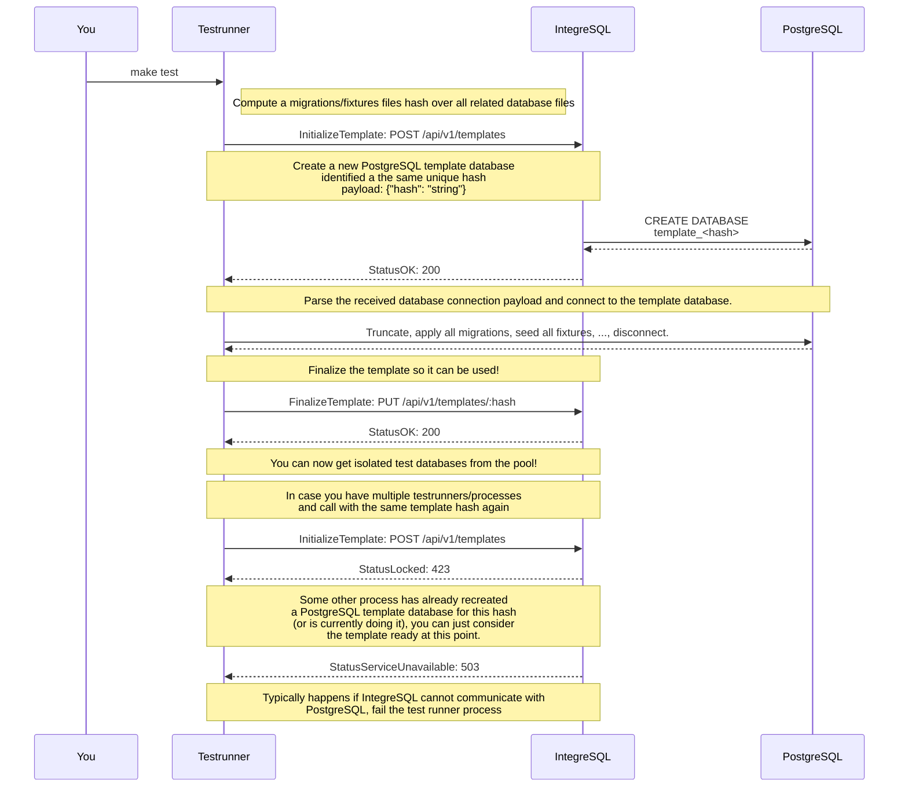

<!-- 
This file contains [mermaid](https://mermaid.js.org) diagrams.

In VSCode:
* install `bierner.markdown-mermaid` to have easy preview.
* install `bpruitt-goddard.mermaid-markdown-syntax-highlighting` for syntax highlighting.

To Export:
* npm install -g @mermaid-js/mermaid-cli
* mmdc -i integration.template.md -o integration.md

Syntax, see https://mermaid.js.org/syntax/entityRelationshipDiagram.html
-->

# Integrate via REST API

## Once per test runner/process:

