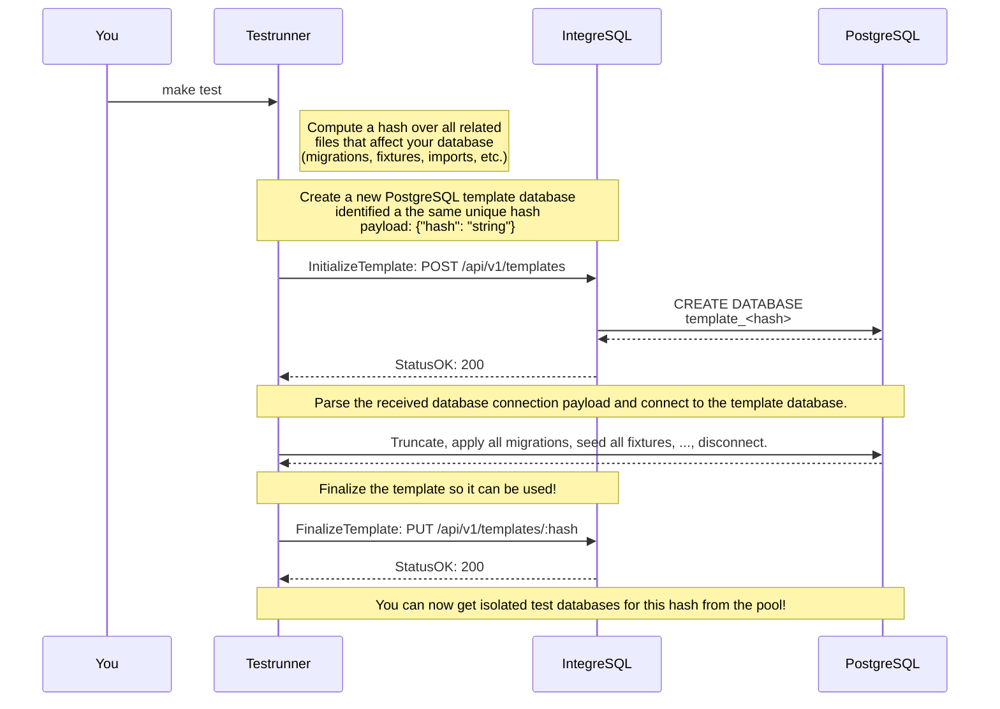
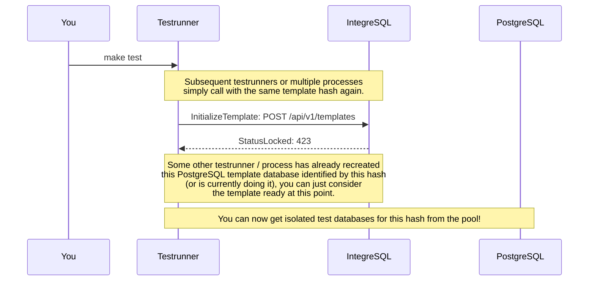
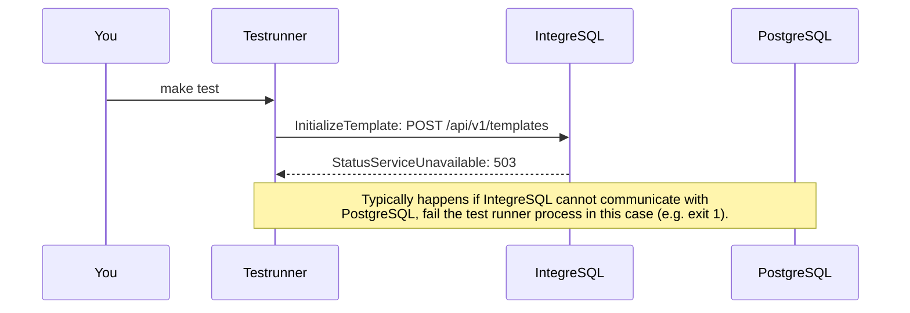

<!-- 
This file contains [mermaid](https://mermaid.js.org) diagrams.

In VSCode:
* install `bierner.markdown-mermaid` to have easy preview.
* install `bpruitt-goddard.mermaid-markdown-syntax-highlighting` for syntax highlighting.

To Export:
* npm install -g @mermaid-js/mermaid-cli
* mmdc -i integration.template.md -o integration.md

Syntax, see https://mermaid.js.org/syntax/entityRelationshipDiagram.html
-->

# Integrate via REST API

First start IntegreSQL and leave it running in the background (your PostgreSQL template and test database pool will then always be warm). 

You then trigger your test command (e.g. `make test`). 1..n test runners/processes then start in parallel.

## Once per test runner/process:

Each test runner that starts need to communicate with IntegreSQL to set 1..n template database pools. The following sections describe the flows/scenarios you need to implement.

### Testrunner creates a new template database

### Testrunner reuses an existing template database

### Testrunner errors while template database setup

